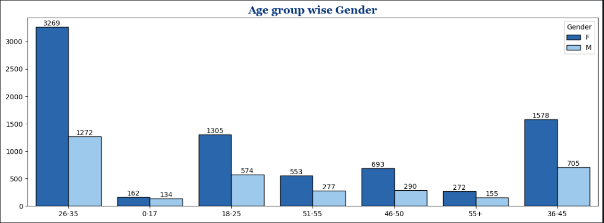
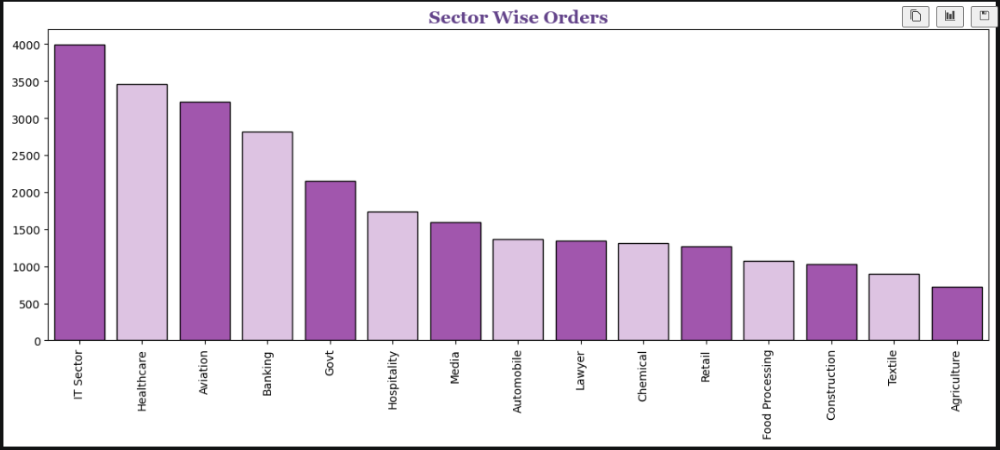
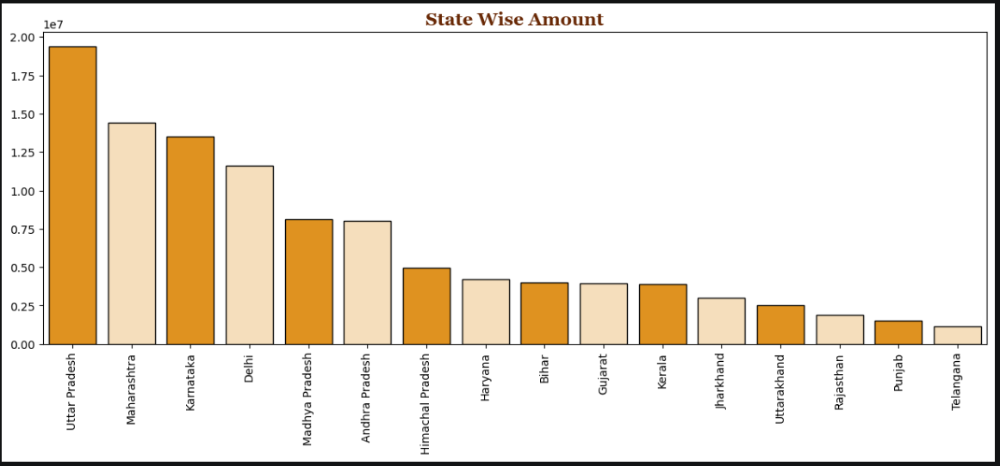
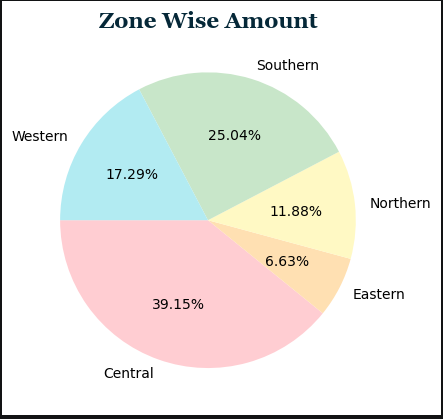

# Sales-Analysis-Python
📊 Sales Analysis Project

📌 Project Overview

This project performs exploratory data analysis on sales data using Python.

The objective is to understand customer behavior, order patterns,
product category performance, sector-wise orders, and geographical
sales performance.

🎯 Objectives

- Perform data cleaning
- Analyze customer behavior
- Analyze sector-wise orders
- Analyze state-wise sales
- Analyze zone-wise sales
- Analyze product category performance
- Generate business insights

🛠️ Tools Used

- Python
- Pandas
- NumPy
- Matplotlib
- Seaborn
- Jupyter Notebook

📊 Data Analysis

The project includes:

- Age group and gender analysis
- Product_Category wise sales analysis
- State wise sales analysis
- Zone wise sales analysis
- Sector wise orders analysis
- Product_category wise orders analysis

💡 Business Insights

- Target the 26–35 age group, especially female customers.
- Focus on high-performing sectors such as IT, Healthcare and Aviation.
- Maintain strong performance in high-revenue states.
- Strengthen sales in Central and Southern zones.
- Focus on high-performing product categories.
- Review low-performing categories and regions for growth opportunities.

📈 Conclusion

The project demonstrates how Python can be used for data cleaning,
exploratory data analysis, visualization, and business insight generation.

👩‍💻 Skills Demonstrated

- Python
- Pandas
- NumPy
- Data Cleaning
- Exploratory Data Analysis
- Data Visualization
- Business Analysis

  📊 Visualizations

Age Group-wise Gender

Product Category-wise Amount

Sector-wise Orders

State-wise Amount

Zone-wise Amount

